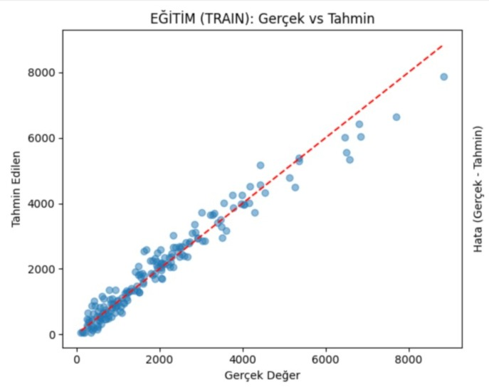

# YSA-MLP-Project
🧠 Artificial Neural Networks | MLP Regression Project
(Yapay Sinir Ağları | MLP Regresyon Projesi)
🇬🇧 [English] Project Overview
This project focuses on implementing a Multi-Layer Perceptron (MLP) model to perform high-accuracy regression analysis. Developed as a term assignment for the Artificial Neural Networks course at Sivas Cumhuriyet University.

🛠️ Tech Stack & Libraries
Language: Python 3.x

Core Libraries: scikit-learn (MLPRegressor), pandas, numpy, matplotlib.

📈 Model Performance
The model demonstrates high predictive power after fine-tuning the hidden layer architecture:

Evaluation Metric: R² Score (Coefficient of Determination)

Final Result: 88.7% (0.887)

Insights: The model shows a strong correlation between actual and predicted values, maintaining stability without overfitting.

🇹🇷 [Türkçe] Proje Özeti
Bu proje, Sivas Cumhuriyet Üniversitesi Bilgisayar Mühendisliği "Yapay Sinir Ağları" dersi kapsamında, Çok Katmanlı Algılayıcı (MLP) mimarisi kullanılarak yüksek doğruluklu bir regresyon analizi gerçekleştirmek amacıyla geliştirilmiştir.

🛠️ Kullanılan Teknolojiler
Dil: Python 3.x

Kütüphaneler: scikit-learn (MLPRegressor), pandas, numpy, matplotlib.

📈 Model Başarısı
Model, hiperparametre optimizasyonu ve veri ön işleme aşamalarından sonra şu sonuçları vermiştir:

Değerlendirme Metriği: R² Skoru (Belirleme Katsayısı)

Final Başarı Oranı: %88.7

Gözlem: Model, gerçek değerler ile tahmin edilen değerler arasında yüksek bir korelasyon sergilemektedir.
